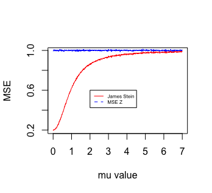
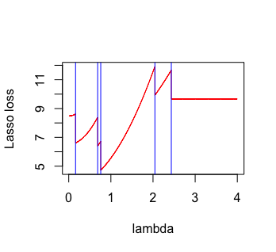
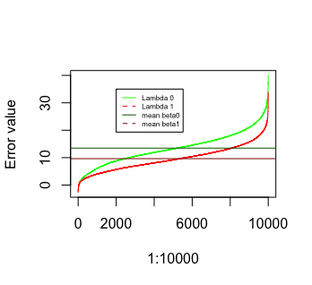

# Exercise 1

In this exercise we will compare mean squred error of Z, which is Gaussian vector having $\mathbb{N}(\mu,Id_n)$ distribution and James Stein estimator defined as $\hat{\mu}_{JS} = Z - (n-2)Z/||Z||_2^2$. We define mean squred error as $\mathbb{E}(||Z-\mu||_2^2)$

To visualize the difference between two estimators we will draw a plot that is showing values of the mean squared error.  Each vector has length 10 and each expected value for entrance is the same. For each value of $\mu$ we simulate 10k vectors and calculate it's MSE. The final output is shown on the plot below 


```{r,eval = FALSE}
library(MASS)

n <- 10 

normal_mse <- c()
js_mse <- c()

place <- 1
set.seed(2020)
for(mu_val in seq(0,7,by = 0.01)){
  
  X_experiment <- mvrnorm(n = 10000,mu = rep(mu_val,times = 10),Sigma = diag(10))
  normal_mse[place] <- mean(rowSums((X_experiment - mu_val)^2)/dim(X_experiment)[2])
  JStein_matrix <- X_experiment - ((n-2)*X_experiment)/rowSums(X_experiment^2)
  js_mse[place] <- mean(rowSums((JStein_matrix - mu_val)^2)/dim(JStein_matrix)[2])
  
  place <- place + 1
}

plot(seq(0,7,by = 0.01),js_mse*10,type = "l",col = "red",xlab = "mu value",ylab = "MSE")
lines(seq(0,7,by = 0.01),normal_mse*10,type = "l",col = "blue")
legend(2, 0.6, legend=c("James Stein", "MSE Z"),
       col=c("red", "blue"), lty=1:2, cex=0.5)
```

```{r message=FALSE, warning=FALSE,echo = FALSE}
library(knitr)
# All defaults

```

I'm normalizing each iteration thats why my score is 10-times lower then expected. 

As we see James Stein estimator is less biased then classical one. The closer real $\mu$ is to zero, the less biased is JS estimator. Normal estimator which is just value from Z vectoe seems to have constant bias, over values of $mu$, close to 1. It's clear that is better to use JS $\mu$ estimator if we want to chave more precise scores.

#Exercise 2

##Exercise 2.1

**File with solution in the ATTACHMENT**

**This eqation is only equal when $\beta$ is a null vector !!**


Some prior notes

$\beta = (3,1,0,0,0)$

$\lambda_0$ be the $\frac{1+(1-\alpha)^{1/p}}{2}$ quantile of $\mathbb{N}(0,\sigma^2)$ distribution


##Exercise 2.2


Having particular observation Y we want to draw a function:
$$ \lambda > 0 \rightarrow ||Y - X\hat{\beta}(\lambda)||_2^2 + 2||\hat{\beta}(\lambda)||_0-5$$

By finding its minimum we will find tuning parameter $\lambda$ that give us smallest mean squred prediction error for the LASSO. This will be also known as $\lambda_1$ parameter.

Some Notes:

We are using orthogonal matrix so $X^TX = 0$, so $\beta^{OLS} = X^TY$. LASSO estimator has following expression:

$$\hat{\beta_i}(\lambda) := sign(\hat{\beta^{OLS}_i})(|\hat{\beta^{OLS}_i}|-\lambda)_+$$ 

```{r,eval = FALSE}
n <- 10
p <- 5
sigma <- 1
alpha <- 0.05 
beta <- c(3,1,0,0,0)

library(pracma)
set.seed(2020)
X = randortho(10)[, 1 : 5]
eps = rnorm(10)


Y <- X %*% beta + eps

beta_ols <- t(X) %*% Y


lasso_estim <- function(b_ols,lambda){
           beta_lasso <- c()
           place <- 1
           for (val in b_ols){
             beta_lasso[place] <- sign(val)*max(abs(val)-lambda,0)
             place <- place + 1
           }
           return (beta_lasso)
}


lasso_loss <- function(beta_lasso,Y,X){
  first_part <-sum((Y- X %*% beta_lasso)^2)
  second_part <- sum(beta_lasso != 0) *2
  final <- first_part + second_part -5
  return(final)
}


lambda_minimizer <- function(b_ols,X,Y){
  
  scores <- c()
  place <- 1
  for(lambda in seq(0.01,4,by = 0.001)){
    
    LASSO_beta <- lasso_estim(b_ols,lambda) 
    loss <- lasso_loss(LASSO_beta,Y,X)
    #cat(loss,"\n")
    scores[place] <- loss
    place <- place + 1
  }
  
  return(scores)
  
}

func<- lambda_minimizer(beta_ols,X,Y)

plot( seq(0.01,4,by = 0.001),func,type = "l",col = "red",xlab = "lambda",ylab = "Lasso loss")
abline(v = abs(beta_ols)[1],col = "blue")
abline(v = abs(beta_ols)[2],col = "blue")
abline(v = abs(beta_ols)[3],col = "blue")
abline(v = abs(beta_ols)[4],col = "blue")
abline(v = abs(beta_ols)[5],col = "blue")
```

```{r message=FALSE, warning=FALSE,echo = FALSE}
library(knitr)
# All defaults

```

Red lines are values of function. Minmum of it, is at point 0.76. Vertical lines are values of $|\beta^{ols}_i|$. We see that if lambda is very close to the one of the beta ols value we have rapid change in value of loss function. It's happenig because then one of the components became zero. $(|\hat{\beta^{OLS}_i}|-\lambda)_+$ this part is zero so entrance is zero as well. Global minimum is reached after labda is bigger then 3 entrances of beta ols so new estimted beta lasso will have 3 zero entries. Exactly as the $\beta$ we are looking for. After point where lambda is bigger then biggest entry of beta ols in absolute value loss function is on constant level. This happen because our estimated beta lasso is a null vector.

##Exercise 2.3

We are going to simulate a lot of $\epsilon$ so we will have a lot of Y. We will compare 
$$\mathbb{E}(||X\hat{\beta}(\lambda_1) - X\beta||_2^2) \; vs  \; \mathbb{E}(||X\hat{\beta}(\lambda_0) - X\beta||_2^2)$$

Then after looking at the plot with ordered values for each lambda and decide which is giving better results.

```{r,eval=FALSE}
betas.0 <- c()
betas.1 <- c()
place <- 1
for(experiment in 1:10000){
  
  cat(experiment,"\n")
  
  eps = rnorm(10)
  Y <- X %*% beta + eps
  beta_ols <- t(X) %*% Y
  
  func_val <- lambda_minimizer(beta_ols,X,Y)
  lambda1_optim <- seq(0.01,4,by = 0.001)[which(min(func_val) == func_val)]
  beta_lasso1 <- lasso_estim(beta_ols,lambda1_optim ) 
  
  lambda0_optmi <- qnorm((1 + (1 - alpha)^(1/p))/2)
  beta_lasso0 <- lasso_estim(beta_ols,lambda0_optmi)
  
  betas.0[place] <- lasso_loss(beta_lasso0,Y,X)
  betas.1[place] <- lasso_loss(beta_lasso1,Y,X)
  
  place <- place + 1
}
```

```{r message=FALSE, warning=FALSE,echo = FALSE}
library(knitr)
# All defaults

```


As we see estimated error with usage of $\lambda1$ tend to be smaller and have minimal value. Horizontal lines are estimtes mean for each of the approach. The main drawback of estimating $\lambda1$ is fact that is it computable cost. Each time we have to minimize the function described in exercise 2.2. On the other hand $\lambda_0$ is much easier to estmate and its giving also not as good but still decent values of beta lasso estimator. I Would state the conclusion as this: 
If we want very precise value we should use $\lambda1$ to estimate beta. On the other hand if we are under presure of time or computable force of pur computer using $\lambda_0$ is also giving us proper results without much loss in information.

--- Mean of error for $\lambda_0 = 13.48$

--- Mean of error for $\lambda_1 = 9.64$


##Exercise 2.4

Again we will simulate a lot of $\epsilon$ to compare FWER for beta lasso estmiators that depend on value of $\lambda$. We define FWER as:
$$\mathbb{P}(\exists i \notin supp(\beta) \; such \; that \; \hat{\beta}(\lambda_{\{0,1\}}) \neq 0)$$

```{r,eval = FALSE}

prob_beta0 <- c()
prob_beta1 <- c()
place <- 1

for(experiment in 1:10000){
  cat(experiment,"\n")
  
  eps = rnorm(10)
  Y <- X %*% beta + eps
  beta_ols <- t(X) %*% Y
  
  func_val <- lambda_minimizer(beta_ols,X,Y)
  lambda1_optim <- seq(0.01,4,by = 0.001)[which(min(func_val) == func_val)]
  beta_lasso1 <- lasso_estim(beta_ols,lambda1_optim ) 
  
  lambda0_optmi <- qnorm((1 + (1 - alpha)^(1/p))/2)
  beta_lasso0 <- lasso_estim(beta_ols,lambda0_optmi)
  
  if(beta_lasso0[3] != 0 || beta_lasso0[4] != 0 || beta_lasso0[5] != 0 ) {prob_beta0[place] <- FALSE} 
  else {prob_beta0[place] <- TRUE} 
  if(beta_lasso1[3] != 0 || beta_lasso1[4] != 0 || beta_lasso1[5] != 0 ) {prob_beta1[place] <- FALSE} 
  else {prob_beta1[place] <- TRUE} 
  
  
  place <- place + 1
}

# FWER for lambda0   
#1 - sum(prob_beta0)/length(prob_beta0)

#FWER for lambda1
#1 - sum(prob_beta1)/length(prob_beta1)

```


--- FWER for $\lambda_0 = 0.0302$

--- FWER for $\lambda_1 = 0.19$

As we see FWER is smaller for $lambda_0$. This lambda is also much easier to compute and is holding FWER below level of $\alpha$ it means that it do not overfit the data is eazy to compute and is not giving us false positive discoveries to extend that $\lambda_1$ does.


Made and described by Szymon Czop.


